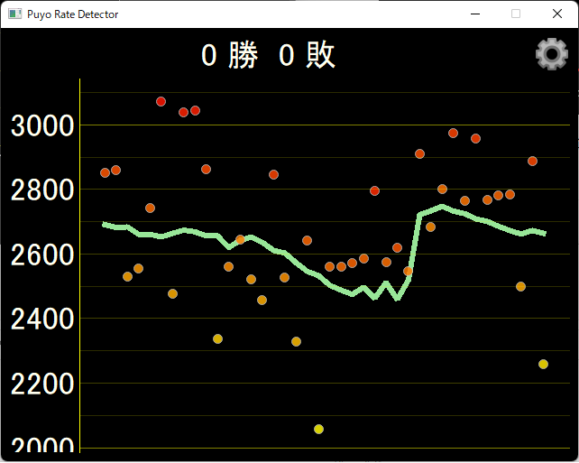
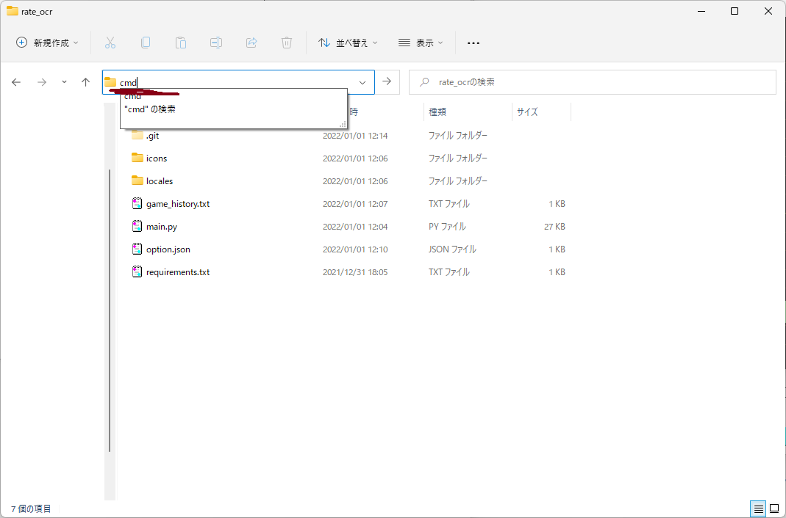
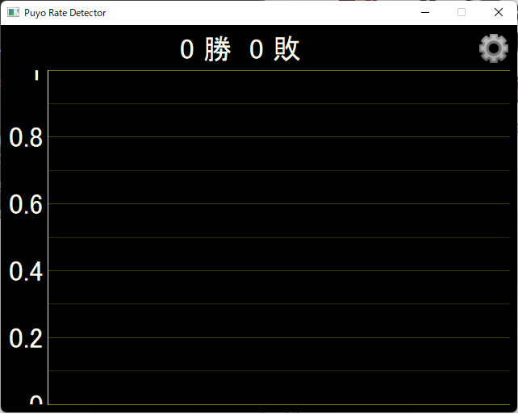

# Puyo Rate Detector

## 概要
ぷよぷよeスポーツのレートをゲーム画面から自動で抽出・記録し、レートの変動をグラフで表示します。<br>
※制作目的はぷよスポですが、設定を変更することでぷよテト２でも同様に動作することを確認しています。<br>


### グラフについて
| 要素 | 説明 | 更新タイミング |
| -------- | -------- | -------- |
| 勝敗 | アプリ起動後の勝敗を表示します。<br>※グラフに表示されている結果の集計ではありません。 | 対戦終了後の自分の更新レートが表示されたタイミングです。 |
| 緑線 | 自分のレートの変動を表示します。 | マッチング完了後、自分と相手のレートが画面に表示されたタイミングです。 |
| 黄色～赤の点 | 対戦相手のレートを表示します。<br>自分とのレート差で色が変わるようになっています。<br>※設定で非表示にできます。 | 同上 |

## 事前準備
必要となる外部のソフトウェアや初期のPythonライブラリのインストールについて説明します。

### python と 外部ソフトウェア
コードを動かすために必要です。先に準備をしてください。

| 必要なもの | つかいどこ |
| -------- | -------- |
| Python3 | メインプログラムを動かします。2系統では動きません。たぶん |
| [Tesseract](https://github.com/tesseract-ocr/tesseract) | OCR(画像認識)で使用します。<br>Installing Tesseractからビルド済みのものをインストールしてください。<br>インストール中の追加の言語パッケージは適宜選択してください。Japanese Scriptはあったほうがいいです。<br>バージョンは5, 4どちらでも大丈夫かと思いますが、5でのみ動作確認しています。 |
| [OBS Virtualcam](https://obsproject.com/forum/resources/obs-virtualcam.949/) |OBS経由でゲーム画面を取得します。<br>右上の"Go to download"ボタンからダウンロードしてください。<br>※OBS標準の仮想カメラではうまく取得できなかったのでプラグインの仮想カメラを使用しています。 |

### venvの設定
コードのフォルダを開き、エクスプローラーのフォルダパス表示される所に```cmd```とうち、コマンドプロンプトを起動します。<br>
<br>
以下のコマンドを実行してpythonの仮想環境を準備します。
```
python -m venv venv
cd venv/Scripts
activate.bat
cd ../..
pip install -r requirements.txt
```
これで事前準備は完了です。


## 起動方法
起動方法について説明します。 <br>
事前準備と同様にコードのフォルダでコマンドプロンプトを開きます。<br>
以下のコマンドを実行して、メインプログラムを実行します。
```
cd venv/Scripts
activate.bat
python main.py
```
以下のような初期画面が表示されれば起動成功です。<br>
※グラフが表示される画面ですが、初期はデータがないので黒い画面が表示されます。<br>


## 設定
右上の歯車を押すと設定画面が出ます。<br>
その画面で設定可能な項目について説明します。

| 設定項目 | 設定内容 |
| -------- | -------- |
| 使用言語 | アプリで使用する言語を指定します。 |
| レート確認間隔(ms) | 画像認識をする間隔をミリ秒で指定します。大きい値にするほど多少負荷が軽くなります。<br>ただし大きくしすぎると認識漏れをする可能性があります。 |
| 初期表示字の試合数 | グラフを最初に表示する際に表示する直近の試合数を指定します。 |
| 対戦相手のレート表示 | グラフに対戦相手のレートを表示するかどうかを選択します。チェックをつけると表示します。 |
| ビデオソース | ゲーム画面をキャプチャしているものを選択します。<br>直接入力せず、１行下にある目のマークを押して専用の設定画面を開いて指定してください。<br>詳細な設定方法は[より詳細な初期設定方法](#より詳細な設定方法)をご確認ください。 |
| 各情報の画像認識範囲 | レートと名前がどこにあるかの範囲を指定します。<br>目のマークを押すと専用の画面が開きます。<br>詳細な設定方法は[より詳細な初期設定方法](#より詳細な設定方法)をご確認ください。  |
| 自分の名前 | 自分の名前の候補を半角スペース区切りですべて列挙します。<br>※画像認識では正確に文字を認識してくれないため、それを人力でカバーします。<br>詳細な設定方法は[より詳細な初期設定方法](#より詳細な設定方法)をご確認ください。 |
| OCR言語設定 | 自分と対戦相手の名前の画像認識で使用する言語を指定します。<br>engでは日本語は認識しません。 |
| 記録用ファイル名 | レートや対戦相手の情報を保存するファイル名を指定します。<br>※ファイルごとにレートを記録します。 |

※保存ボタンを押さないと設定が保存されません。設定を変更したら保存ボタンの押し忘れにご注意ください。

## より詳細な設定方法
わかりにくい設定項目をより詳しく説明します。

### OBS VirtualCamの起動
OBSのツール＞VirtualCamで設定画面を開く。<br>
Startで起動。<br>
※常に使うつもりなら、AutoStartをつけておくと便利です。

### ビデオソース
始める前にOBS VirtualCamが起動していることをご確認ください。<br>
0から順に数字をあげていってください。ゲーム画面(OBSの画面)がキャプチャされたらそれを選択してください。<br>
※映像の切り替えには３０秒ほど時間がかかる場合があるので、気長に待ってください。

### 各情報の画像認識範囲
※初期設定は画面比率16:9、ゲーム画面を全画面表示している場合の設定になっています。<br>
　同様の設定で配信されている方は設定は不要ですが、一応正しいかを確認してください。

先にビデオソースの選択を完了させてから設定してください。<br>
入力項目にフォーカスするとその項目の現在の設定内容が緑色の枠で表示されます。<br>
その範囲が期待と違った場合、設定が必要となります。<br>
数値入力もできますが、直接映像上にマウスでの範囲指定が可能なので、そちらもご利用ください。<br>

各項目がどの範囲を設定すべきかは画像を参考にしてください。<br>
※名前は自分の名前の幅だけでも動作上は問題ないですが、一応記録ファイルには相手の名前も記録しているのでそれを考慮して幅を広く指定しておくと後で役立つかもしれません。

| 設定項目 | 色 |
| ------ | --- |
| 左のレート | 赤 |
| 左の名前 | 黄 |
| 右のレート | 青 |
| 右の名前 | 緑 |
| 対戦後のレート | 紫 |


### 自分の名前
※※※<br>
　**この設定が不要になるような改善をしたいので、誰か知恵をかしてください。<br>
　画像認識精度の向上・似た文字列の判定等募集。<br>
　コードでいうとRateDetector#recognize_text, crop_white_character あたりです。**<br>
※※※<br><br>
<u>※自分が1P(左側)のときのゲームプレイで実施してください。</u><br>
<u>※一度OBSの機能を利用しゲームを録画して、それをOBS上で何度か再生して作業することをお勧めします。</u><br>

メインプログラムを起動し、OBSで画像認識の対象画面を表示すると、 コマンドプロンプトに以下のようなログが出力されます。<br>
```INFO:root:ひつきき: 2723, masked: 2666```
これは画像認識で認識されたレートと名前です。<br>
おそらくレートは正しく認識されているのに対して、名前は見知らぬ名前が表示されると思います。<br>
これは名前が正しく認識できず、間違った名前が表示されているためです。<br>
この間違った認識を列挙することで自分の名前と認識させるのがこの項目です。<br>
列挙する際は半角スペースで区切ります。


#### 実際の例
例を示します。例えば以下のようなログが出力されたとします。
```
INFO:root:はつつ: 2723, masked: 2666
INFO:root:ひつきき: 2723, masked: 2666
INFO:root:ひつきき: 2723, masked: 2666
INFO:root:ひつきき: 2723, masked: 2666
INFO:root:ひつきを: 2723, masked: 2666
INFO:root:ひつきを: 2723, masked: 2666
INFO:root:ひつきを: 2723, masked: 2666
INFO:root:ひつきを: 2723, masked: 2666
INFO:root:ひつきを: 2723, masked: 2666
INFO:root:ひひつきを: 2733, masked: 2727
INFO:root:ひひつきを: 2733, masked: 2727
INFO:root:ひつきを: 2733, masked: 2727
INFO:root:ひつきを: 2733, masked: 2727
```
自分の名前は「ひつき」なのですが、出力では一度もでてきません。<br>
その代わり「はつつ」「ひつきき」「ひつきを」「ひひつきを」のように自分の名前に似た文字列が出力されています。<br>
これらが誤認識された名前です。これらを自分の名前と設定することでこれらも自分の名前と認識してくれるようになります。<br>
実際に項目に設定する文字列は以下となります。<br>
```はつつ ひつきき ひつきを ひひつきを```

## トラブルシューティング
後で追記予定
